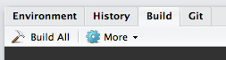

# Protocol notebook

This project contains various lab protocols written in [Rmarkdown](http://rmarkdown.rstudio.com), which can be rendered into HTML, PDF, and Word format. Correctness of protocols is not guaranteed. If you find an issue or want to suggest an improvement, please [submit an issue](https://github.com/EricEdwardBryant/Protocols/issues).

Individual protocols can be rendered using the `rmarkdown` package. Just install [R](https://cloud.r-project.org), and run the following in an R console. Note that PDF rendering also requires [LaTeX](https://latex-project.org/ftp.html).

```r
# In R
install.packages('rmarkdown')  # install if necessary

# Choose one or more desired formats
formats <- c('html_document', 'pdf_document', 'word_document')

# Render the document to the desired format(s)
rmarkdown::render('path/to/protocol.Rmd', output_format = formats)
```

This project has a [Makefile](https://en.wikipedia.org/wiki/Make_(software)) to make it easy to render all Rmarkdown files in Rstudio with the click of a single button. To render all of the protocols in this notebook with the click of a button you will need to install `make` (see below) and [Rstudio](https://www.rstudio.com). Then, clone this project to your computer, open `Protocols.Rproj` to open this project in Rstudio and press the `Build All` button.



You can also simply use `make` from the terminal.

```shell
# Navigate to Protocols
cd path/to/Protocols

# Render to HTML, PDF, and WORD
make

# Or, render to a specific format
make word
make pdf    # Requires LaTeX
make html
```

# Install `make`

### OS X (>=10.9)

Make is included with OS X's command line tools.

```
# In terminal
xcode-select  --install
```

### Windows

Currently not supported. Let me know if you know how to get Makefiles to work with Rstudio on Windows.

### Linux

Make is typically included.
