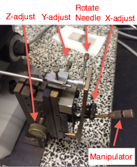
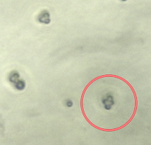

### Materials:

- Sporulated diploid yeast (SPO media)
- Zymolase (concentration?)
    - Stored in 'YPD' box in 4$^{\circ}$C
- YPD plate (thin)

### Protocol:

- In microfuge tube, add 20 $\mu$L Zymolase
- Scrape small amount of sporulated cells and add to tube
- Incubate 30 min at 30$^{\circ}$C
- Add 30 $\mu$L of sterile dH~2~O
- Drop 10 $\mu$L onto thin YPD plate

- Set up dissection microscope
    - Drop needle to lowest position
    - Place plate on stage
    - Focus on plate surface (use cells as reference)
    - Check for tetrads
    - Slowly bring needle up to surface with manipulator all the way up (i.e. away from plate surface)
    - Adjust needle such that it touches plate when manipulator is pulled down

- Array spores in 5 mm grid
    - Try to pick up isolated tetrads
    - Tip: if tetrad does not split, try tapping the marble table.

